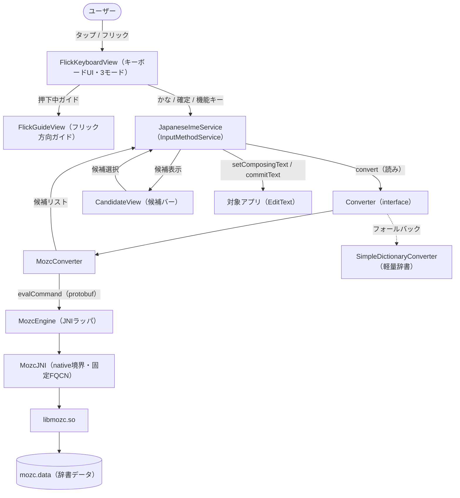
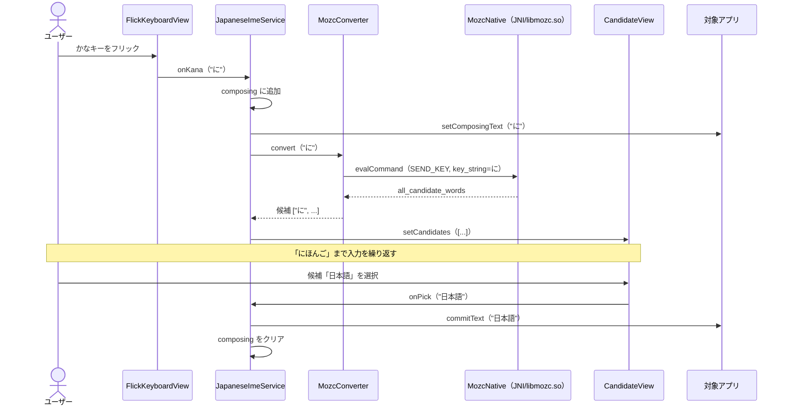
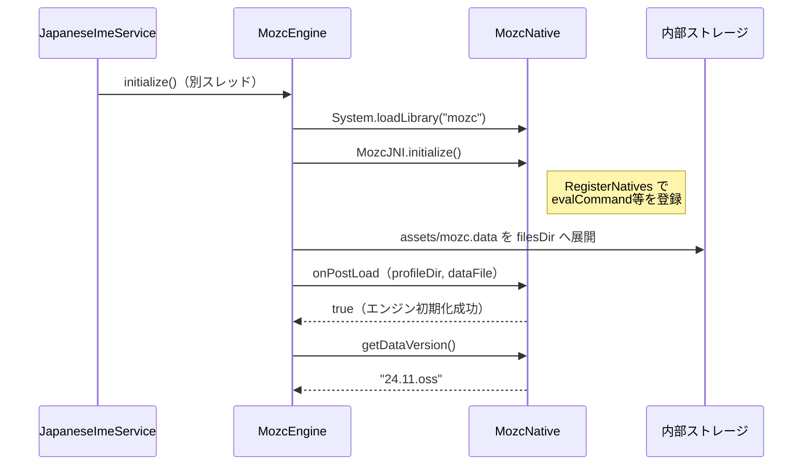

# アーキテクチャ図 — NihongoIME

## ブロック図（コンポーネント構成）

```mermaid
flowchart TD
    User([ユーザー]) -->|"タップ / フリック"| KB["FlickKeyboardView（キーボードUI・3モード）"]
    KB -->|"押下中ガイド"| Guide["FlickGuideView（フリック方向ガイド）"]
    KB -->|"かな / 確定 / 機能キー"| IME["JapaneseImeService（InputMethodService）"]

    IME -->|"convert（読み）"| Conv["Converter（interface）"]
    Conv --> Mozc["MozcConverter"]
    Conv -.フォールバック.-> Simple["SimpleDictionaryConverter（軽量辞書）"]

    Mozc -->|"evalCommand（protobuf）"| Engine["MozcEngine（JNIラッパ）"]
    Engine --> JNI["MozcJNI（native境界・固定FQCN）"]
    JNI --> SO["libmozc.so"]
    SO --> Data[("mozc.data（辞書データ）")]

    Mozc -->|"候補リスト"| IME
    IME -->|"候補表示"| Cand["CandidateView（候補バー）"]
    Cand -->|"候補選択"| IME
    IME -->|"setComposingText / commitText"| App["対象アプリ（EditText）"]
```

## シーケンス図（かな入力 → 変換 → 確定）

```mermaid
sequenceDiagram
    actor U as ユーザー
    participant KB as FlickKeyboardView
    participant IME as JapaneseImeService
    participant MC as MozcConverter
    participant NA as MozcNative（JNI/libmozc.so）
    participant CV as CandidateView
    participant AP as 対象アプリ

    U->>KB: かなキーをフリック
    KB->>IME: onKana（"に"）
    IME->>IME: composing に追加
    IME->>AP: setComposingText（"に"）
    IME->>MC: convert（"に"）
    MC->>NA: evalCommand（SEND_KEY, key_string=に）
    NA-->>MC: all_candidate_words
    MC-->>IME: 候補 ["に", ...]
    IME->>CV: setCandidates（[...]）
    Note over U,CV: 「にほんご」まで入力を繰り返す
    U->>CV: 候補「日本語」を選択
    CV->>IME: onPick（"日本語"）
    IME->>AP: commitText（"日本語"）
    IME->>IME: composing をクリア
```

## シーケンス図（Mozc初期化）

```mermaid
sequenceDiagram
    participant IME as JapaneseImeService
    participant ME as MozcEngine
    participant NA as MozcNative
    participant FS as 内部ストレージ

    IME->>ME: initialize()（別スレッド）
    ME->>NA: System.loadLibrary("mozc")
    ME->>NA: MozcJNI.initialize()
    Note right of NA: RegisterNatives で<br/>evalCommand等を登録
    ME->>FS: assets/mozc.data を filesDir へ展開
    ME->>NA: onPostLoad（profileDir, dataFile）
    NA-->>ME: true（エンジン初期化成功）
    ME->>NA: getDataVersion()
    NA-->>ME: "24.11.oss"
```
